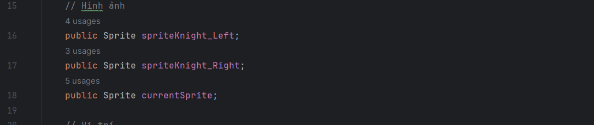
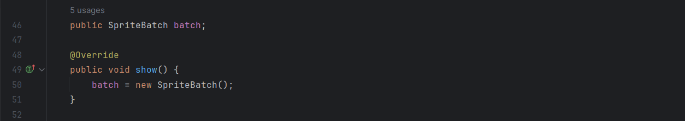
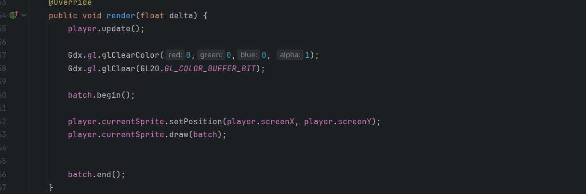
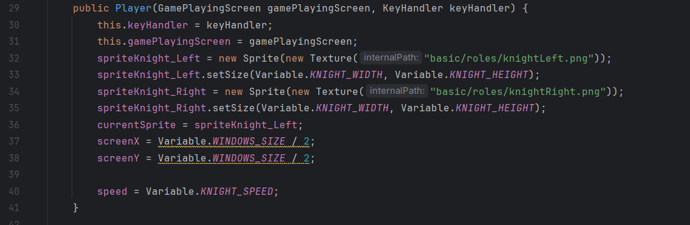
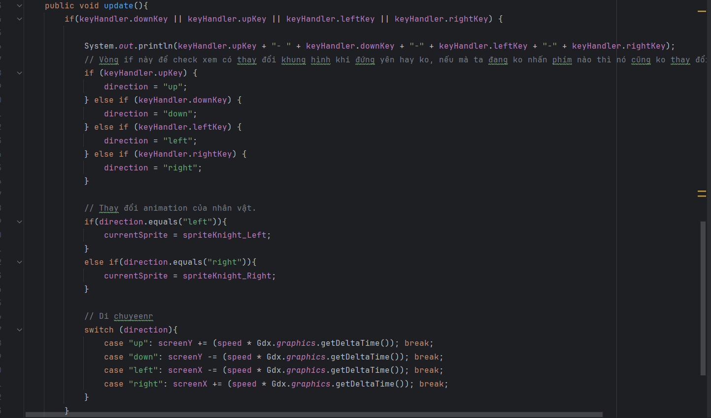

1. Tạo sprite và sprite batch.
   2. 
   2. 
2. Vẽ sprite:
   1. 
3. Di chuyển nhân vật và thay đổi sprite theo hướng đi:
   1. Tạo các sprite và setting cần thiết:
      1. 
   2. Di chuyển:
      1. 
      2. Nhớ là phải setposition trước khi draw, ko là nó để lại cái dư ảnh vì draw trước đó.